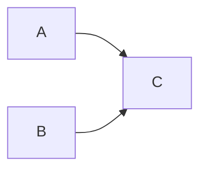

[TOC]

# Week 2

## Prelecture

### Dynamic memory allocation

```cpp
// General syntax
DataType1 *my_scalar{new data_type_1};		// memory is assessed with pointer my_scalar
DataTyle2 *my_array{new data_type_2[N]};	// memory is assessed with pointer my_array
// Memory is freed
delete my_scalar;
delete[] my_array;
```

### File streams

```cpp
#include <fstream>
std::ifstream my_input_file; 	// A file stream for reading only
std::ofstream my_output_file;	// A file stream for writing only
std::fstream my_file;		// A file stream for both reading and writing
```

```cpp
my_file.open("data1.dat");	// open file
std::ftstream my_file{"data1.dat"}	// open and attach file to my_file
my_file.close()
```

```cpp
int my_data;
my_file >> my_data;	// extract an integer from the file stream my_file
int my_code{234};
my_file << my_code;	// insert mycode into file stream my_file
```

#### Member functions inherited from `std::basic_ios`

```cpp
if (!my_file.good()){
    // To check if our file opened successfully
    std::cerr << "Error: file could not be opened" << std::endl;
    return(1);
}
```

```cpp
if (!my_file.fail()){
    // To check if data is read successfully
    std::cerr << "Error: could not read data from file" << std::endl;
    return(1);
}
```

```cpp
std::ifstream file("test.txt");
if(!file)  // operator! is used here
{  
    std::cout << "File opening failed\n";
    return EXIT_FAILURE;
}
ba
// typical C++ I/O loop uses the return value of the I/O function
// as the loop controlling condition, operator bool() is used here
for(int n; file >> n; ) {
   std::cout << n << ' ';
}
std::cout << '\n';

if (file.bad())
    std::cout << "I/O error while reading\n";
else if (file.eof())
    std::cout << "End of file reached successfully\n";
else if (file.fail())
    std::cout << "Non-integer data encountered\n";
```

```cpp
constexpr auto max_size = std::numeric_limits<std::streamsize>::max();

std::istringstream input("1\n"
                         "some non-numeric input\n"
                         "2\n");
for (;;)
{
    int n;
    input >> n;

    if (input.eof() || input.bad())
        break;
    else if (input.fail())
    {
        input.clear(); // unset failbit
        input.ignore(max_size, '\n'); // skip bad input
    }
    else
        std::cout << n << '\n';
}
```

```cpp
#include <iostream>
#include <string>
 
int main()
{
    for (char c : {'\n', '4', '1', '.', '3', '\n', 'Z', 'Y', 'X'})
        std::cin.putback(c); // emulate user's input (not portable: see ungetc Notes)
 
    double n;
    while (std::cout << "Please, enter a number: " && !(std::cin >> n))
    {
        std::cin.clear();
        std::string line;
        std::getline(std::cin, line);
        std::cout << line << "\nI am sorry, but '" << line << "' is not a number\n";
    }
    std::cout << n << "\nThank you for entering the number " << n << '\n';
}
```

# Week 3

## Prelecture

### Strings

#### Strings as array of characters

```cpp
// define string
const size_t no_char{100}; 		// Size of array, keep constant as it won’t change
char string1[no_char]; 			//fixed length array to store string
char *string2;
string2 = new char[no_char];
// Get the string filled with something
sprintf(string2, "This is a string that has fewer than 100 characters.");
delete string2;
```

```cpp
#include <cstring>
strcpy(string1,"This is string1");
strcpy(string2,"This is string2");
```

**`sprintf`**

```cpp
// Incorporate non-string data and format it correctly
int sprintf(char *str, const char *format, ...)
```

```cpp
char output_filename[100];
int file_index{123};
sprintf(output_filename, "FileData.%d", file_index);
std::cout << output_filename << std::endl;
```

```cpp
char str[80];
sprintf(str, "Value of pi=%f", M_PI);		// Value of Pi = 3.141593
```

#### Strings from the standard library

```cpp
#include <string>
std::string my_first_string{"Hello, world!"};
std::cout << "Length of string = " << my_first_string.length() << std::endl;
std::cout << "2nd character in string is " << my_first_string[1] << std::endl;
```

```cpp
// Define them from terminal input
std::string input_string;
std::cout << "Endter a phrase: ";
std::cin >> input_string;
```

- This only extracts one word as the input terminates at fist whitspace character (leaving rest of text and newline in buffer)

```cpp
// An entire sentence
getline(std::cin, input_string);
```

**String manipulation**

```cpp
string my_first_string{"Hello, world!"};
string my_second_string{"Hello, world!"};
if (my_first_string == my_second_string)
    std::cout << "Strings match!" << std::endl;
```

```cpp
string joined_string{first_string + second_string};		// join
first_string += second_string; 	// append
```

```cpp
// Extracting
extracted_str = str.substr(0, 4)	
```

#### `sstream`

```cpp
int file_index{123};
ostringstream output_stream;
output_stream << "FileData." << file_index;
string output_filename{output_stream.str()};
std::cout << output_filename << std::endl;
```

```cpp
// clear the content of the buffer
output_stream.str()
```

### Arrays and vectors

#### Iterators

```cpp
std::vector<double>::iterator vector_begin{vector_double.begin()};
std::vector<double>::iterator vector_end{vector_double.end()};
std::vector<double>::iterator vector_iterator;
```

# Week 4

## Lecture

Object-Oriented Programming

- Abstracton: keep data private, alter properties via methods only.
- Encapsulation: keep data private, alter properties via methods only.
- Inheritance: classes can be based on other classes to avoid code duplication.
- Polymorphism: can decide at run-time what methods to invoke for a certain class, based on the object itself.

> How many different access specifiers can we have in class?
>
> > 3, (`private`, `protected`, `public`)
>
> The fields in a class in a C++ program are by default
>
> > `private`
>
> Constructors in a class are used to:
>
> > Initialise objects and construct an object's data
>
> What are the main difference between struct and class?
>
> > Acess in a struct is public by default


# Week 5

## Prelecture

###  `class`

#### `const` in functions

The `const` modifier can be used in functoin parameter lists

```cpp
// Passing by reference
double dot_product(const vector3 &v1, const vector3 &v2);
```

- It guarantees argument cannot be modified inside the function.
- Useful when passing by reference to speed thigns up.

```cpp
// Const member functions
vector3 plus(const vector3 &v) const
```

- It guarantees data members are not modified.

---

#### Objects as function arguments & Returning objects from functions

```cpp
// Example (old-fashioned)
double dot_product(const vector3 &v1, const vector3 &v2)
{
    double result = v1.get_x() * v2.get_x() + v1.get_y() * v2.get_y() + v1.get_z() * v2.get_z()
}
```

```cpp
// Example (key feature of OOP: encapsulation)
// Passing objects to member functions
double dot_product(const vector3 &v) const
{
    return (x * v.x + y * v.y + z * v.z);
}
double dp = b.dot_product(c);
```

```cpp
// Return objects from functions
vector3 plus(const vector3 &v) const
{
    vector3 temp{x + v.x, y + v.y, z + v.z}
    return temp;
}
```

#### Operator overloading

```cpp
vector3 operator+(const vector3 &v) const
{
    vector3 temp{x + v.x, y + v.y, z + v.z};
    return temp;
}
vector3 e{b + c};
```

```cpp
// Right addition of a scalar to a vector
vector3 operator+(const double scalar) const
{
    vector3 temp{x + scalar, y + scalar, z + scalar};
}
vector3 f{e + 1.5}
```

```cpp
// Non-member function to left-add scalar to vector
vector3 operator+(double scalar, const vector3 &v)
{
    vector3 temp;
    temp.set_x(scalar + v.get_x());
    temp.set_y(scalar + v.get_y());
    temp.set_z(scalar + v.get_z());
    return temp;
}
```

Functions that are friends are ordinary functions but can access members' data of "friendly" objects.

```cpp
friend vector3 operator+(double scalar, const vector3 &v);
vector3 operator+(const vector3 &v)
{
    vector3 temp{scalar + v.x, scalar + v.y, scalar + v.z};
    return temp;
}
```

## Lecture

```cpp
class class_b; // forward declaration
class class_a 
{
public:
  int function1(class_b& b); // must be public since declared as friend 
  int function2(class_b& b);
};
class class_b 
{
private:
  int b_store;
  friend int class_a::function1(class_b&);
};
int class_a::function1(class_b& b) {return b.b_store;}  //legal since friend
int class_a::function2(class_b& b) {return b.b_store;}  //illegal
int main() {
  return 0;
}
```

```cpp
class class1
{
	friend class friend_class;  // Declare a friend class
public:
    class1() : top_secret{rand()} {}
    void print_member() { std::cout << top_secret << std::endl; }
private:
    int top_secret;
};
class friend_class
{
public:
    void change(class1& object1, int x){object1.top_secret = x;}
};
int main() 
{
    class1 befriended;
    friend_class friendly;
    befriended.print_member();
    friendly.change(befriended,rand());
    befriended.print_member();
}
```

> Operator that cannot be overloaded: `.`, `::`, `?:`, `sizeof`

### Overloading insertion operator `<<`

```cpp
friend std::ostream& operator<<(std::osream &os, const vector3 &v);
std::ostream& operator<<(std::ostream &os, const vector3 &v)
{
    os << "(" << v.x << v.y << "," << v.z << ")";
    return os;
}
```

### Static (Data) members

```cpp
class item
{
  static int count;
  int number;
public:
  void getdata(int a) {number=a; count ++;}
  void getcount(void)
    {
      std::cout<< "count:" << count << "\n";
    }
};
int item:: count;
int main()
{
    item a, b, c; //count is initialized to zero
    a.getcount(); //display count
    b.getcount();
    c.getcount();
    a.getdata(100); //getting data into object a
    b.getdata(200); //getting data into object b
    c.getdata(300); //getting data into object c
    std::cout<<"After reading data"<<"\n";
    a.getcount(); //display count
    b.getcount();
    c.getcount();
    return 0;
}
```

```cpp
int ** const p_int;				// const pointer to (a pointer to an int)
int * const * p_int;			// pointer to (a const pointer to an int)
int const ** p_int;				// pointer to (a pointer to a const int)
int const * const * p_int;		// const pointer to (a const pointer to an int)
```

# Week 6
## Prelecture

### Overload `[]` operator

```cpp
double & dynamic_array::operator[](size_t i)
{
    if(i < 0 || i >=size) {
        throw("OutOfBoundError");
    }
    return array[i];
}
```

### Replicate objects

```cpp
// Copy constructor for deep copying
dynamic_array::dynamic_array(dynamic_array &arr)
{
    array = nullptr;
    size = arr.length();
    if (size > 0) {
        array = new double[size];
        for (size_t i{}; i < size; i++)
            array[i] = arr[i];
    }
}
dynamic_array a3 = a1;
dynamic_array a4{a1};
```

Assignment operator: similar to copy constructor except that we assume the object is already constructed.

```cpp
dynamic_array& dynamic_array::operator=(dynamic_array &arr)
{
    if (&arr == this)
        return *this;
    
    delete[] array;
    array = nullptr;
    size = arr.length();
    
    if (size > 0) {
        array = new double[size];
        for (size_t i{}; i < size; i++)
            array[i] = arr[i];
    }
    return *this;
}
```

- When we are overloading `operator=`, we need to protect against possible self-assignment. In this case, code would crash since it could delete the object's data before trying to copy itself.
- When returning an object by value a copy is made and returned, the original object is then destroyed.

- The assignment operator returns a reference to the basic type `dynamic_array &`, so one can write

```cpp
a = b = c;	// same as a = (b = c)
```

### Rvalues and lvalues

**Lvalue** is something where we can take the address, something in (semi) pernmanet memory. An **rvalue** refers to a temporary object; in order to capture these in permanent memory, the only way is to copy them into an lvalue.

#### rvalue reference

Allows us to write functions that specifically deal with mutable temporary variables.

```cpp
print_reference(const String& str) { std::cout << str; }
```

- Accepts any argument it is given, lvalue or rvalue.

```cpp
print_reference(String&& str) { std::cout << str; }
```

```cpp
print_references(std::string{"Hello World"}) 	// pass a rvalue
```

- Picks up a mutable rvalue.

#### Move semantics

The most common way of using rvalue refereces is in the **move constructor** and **move assignment**. They take an rvalue reference.

```cpp
// Move constructor
dynamic_array::dynamic_array(dynamic_array &&arr)
{
    size = arr.size;
    array = arr.array;
    arr.size = 0;
    arr.array = nullptr; 
}
```

```cpp
// Move assignment operator
dynamic_array& dynamic_array::operator=(dynamic_array &&arr)
{
    std::swap(size, arr.size);
    std::swap(array, arr.array);
    return *this;
}
```

#### `std::move`

Suppose we know an lvalue object that is **no longer useful**, and we do want to use the move assignment to reassign its data.

`std::move` turns an lvalue into something that can be used like an rvalue. `std::move` itself moves nothing.

```cpp
dynamic_array a3(2);
a3[0] = 0.5;
a3[1] = 1.0;
dynamic_array a4;
a4 = std::move(a3);
```

## Lecture

### Quizzes

- Difference between `myclass a2{a1}`, `myclass a2=a1`, `myclass a2; a2=a1`

> Direct initialisation (`myclass a2{a1}`): It behaves like a function call to an overloaded function, the functions are the constructors of `myclass` (including explicit ones), and the argument is `a1`.
>
> Copy initialisation (`myclass a2=a1`): It constructs an implicit conversion sequence. It tries to cast `a1` to an object of type `myclass`. It then copies the object into the initialised object, so a copy constructor is need too.
>
> Assignment (`myclass a2; a2=a1`): First constructs `a2` and then calls the assignment operator in `myclass`.

- What is the default type of copy in the overloaded assignment operator`=`, if we don't define our own.

> Bitwise copy (shallow copy)

- Why is it potentially more difficult to "delete" the storage of an object when using shallow copying than when using deep copying?

> Because it is hard to keep track of whether data inside the object is still in use.

- What is the difference between the copy assignment operator and the copy constructor?

> The first one just copies the data from one object to a new object. The second one creates a new object using the data of the input object as a template.

- About `this` pointer

> It is passed as a hidden argument to all non-static function calls and is available as a local variable within the body of all non-static functions. 
>
> It is not available in static member functions, since static member functions can be called without any object (i.e., with only the class name). Those functions effectively act on the class.

- Is `f1()` an rvalue or lvalue?

> ```cpp
> int p{10};
> int& f1() {return p;}
> ```
>
> lvalue. We can write `f1()=20`.

- A move assignment operator takes ( ) as argument.

> An rvalue reference.
>
> It takes a reference to a temporary value since it must be able to deal with the data inside it without doing damage to the integrity of the data held in the code. So reference for access to that data, rvalue we know we can safely modify the object.

### Lazy copying

Deep copying is usually "the right thign to do". But it can be very expensive. We have seen that sing move semantics can help, but there is an alternative.

**Lazy copy** is a combination of shallow and deep copy. It takes advantage of the speed of shallow copy whenever possible, but functions just as a deep copy. It is only useful when data is not modified very often.

- When initially copying an object, a fast shallow copy is used. A list or a counter is used to track the objects sharing the same data.
- When the program wants to modify an object, it can thus determine if the data is shared and can do a deep copy if necessary, removing the object from the list/resetting the counter.
- The downside is the overhead present in the bookkeeping.

```cpp
class array_2d
{
public:
    array_2d();
    array_2d(int, int);
    array_2d(array_2d const &);
    array_2d &operator=(array_2d const &);
    ~array_2d();
    double &&element(int, int) const;
    double &operator()(int, int);

private:
    class data
    {
    public:
        data();
        data(int i, int j);
        data(data const &d);
        ~data();
        double &element(int i, int j); // reference to given entry
        // use_count is the number of array_2d objects that point at this
        // use_count must be initialized to 1 by all constructors
        size_t use_count{1};
        double *array{nullptr}; // pointer to hold data
        int dim1{};
        int dim2{}; // dimensions
    };
    data *data_storage{nullptr};
};
```

```cpp
array_2d::data::data() = default;
array_2d::data::data(int i, int j) : array{new double[i * j]}, dim1{i}, dim2{j} {}
array_2d::data::data(data const &d) // deep copy
{
    std::cout << " deep copy\n";
    array = new double[(d.dim1) * (d.dim2)];
    for (int i{}; i < d.dim1 * d.dim2; i++)
        array[i] = d.array[i];
}
array_2d::data::~data()
{
    std::cout << " deleting data\n";
    use_count = 0;
    dim1 = 0;
    dim2 = 0;
    delete[] array;
}
double &array_2d::data::element(int i, int j)
{
    // could do bounds checking
    return array[dim1 * i + j];
}
array_2d::array_2d() : data_storage{new data()} {}
array_2d::array_2d(int i, int j) : data_storage{new data{i, j}} {}
array_2d::array_2d(array_2d const &array_cp) // copy constructor
    : data_storage{array_cp.data_storage}    // make sure our data points to f's data
{
    ++data_storage->use_count; // increment the counter
}
```

# Week 7

## Prelecture

### Inheritance and access

```cpp
class celestial_object
{
public:
    std::string name;
    double mass, distance, luminosity;
public:
    celestial_object() : name{"no-name"}, mass{}, distance{}, luminosity{} {}
    celestial_object(const std::string nm, const double l, const double m, const double d) : name{nm}, mass{m}, distance{d}, luminosity{l} {}
    std::string getname() const { return name; }
};
class galaxy : public celestial_object
{
private:
    std::string hubble_type;
public:
    galaxy() : celestial_object{}, hubble_type{"Sc"} {}
    galaxy(const std::string nm, const double l, const double m, const double d,
           const std::string ht) : celestial_object{nm, l, m, d}, hubble_type{ht} {}
};
```

| (Base class access)   | `Private` | `Protected` | `Public` |
| --------------------- | --------- | ----------- | -------- |
| Class members         | Yes       | Yes         | Yes      |
| Derived class members | No        | Yes         | Yes      |
| Outside               | No        | No          | Yes      |

```cpp
class celestial_object
{
private:
    std::string name;
```

- Derived class can not access private data from the base class.

```cpp
class celestial_object
{
protected:
    std::string name;
```

- Protected members can be accessed in the derived class.

| Base class access specifier(⬇️) \ Inheritance specification(➡️） | `private`     | `protected`   | `public`      |
| ------------------------------------------------------------ | ------------- | ------------- | ------------- |
| `private`                                                    | Not inherited | Not inherited | Not inherited |
| `protected`                                                  | `private`     | `protected`   | `protected`   |
| `public`                                                     | `private`     | `protected`   | `public`      |

```cpp
class galaxy : public celestial_object
{
private:
// Base class access specifier: 
```

- When using `public`, the access levels for our inherited (non-private) members are the same as they were in the base class.
  - `protected` members of the base class are inherited as protected members of the derived class

- Base class specifier sets maximum access level.
- Private members are never accessible outside a class.

### Constructors in derived class

```cpp
galaxy(const std::string nm, const double l, const double m, const double d,
       const std::string ht) : celestial_object{nm, l, m, d}, hubble_type{ht} {}
```

- If we don't specify anything, the default constructor for `celestial_object` is invoked whenever we create a galaxy.
- We need to invoke ase class constructors first so that is data to be inherited by the instance of the derived class.
- The base class constructor is called first, followed by the derived class constructor.
- The reverse happen for the destructor

### Overriding functions

C++ allows us to define funcions in base and derived class with the same name (overriding).

- Overriding requires both functions to have exactly the same parameter list.
- Overloading requires functions to have different parmeter list.

### Multiple inheritance

```cpp
class A
{
protected:
    double Ax;

public:
    A(const double Axin) : Ax{Axin} {}
    void show() { std::cout << "Ax=" << Ax << std::endl; }
};
class B
{
protected:
    double Bx;

public:
    B(const double Bxin) : Bx{Bxin} {}
    void show() { std::cout << "Bx=" << Bx << std::endl; }
};
class C : public A, public B
{ 	// Single derived class
    double Cx;

public:
    C(const double Axin, const double Bxin, const double Cxin) : A{Axin}, B{Bxin}, Cx{Cxin} {}
    void show() { std::cout << "Ax,Bx,Cx = " << Ax << " " << Bx << " " << Cx << std::endl; }
};
```



```cpp
class celestial_object
{
protected:
    std::string name{"no_name"};
    double mass{};
    double distance{};
    double luminosity{};

public:
    celestial_object() = default;
    celestial_object(const std::string nm, const double l, const double m, const double d) : name{nm}, mass{m}, distance{d}, luminosity{l} {}
    ~celestial_object() {}
    std::string get_name() const { return name; }
    friend std::ostream &operator<<(std::ostream &, const celestial_object &);
};
class star : public celestial_object
{
protected:
    std::string spectral_class{"None"};

public:
    star() : celestial_object{}, spectral_class{"None"} {}
    star(const std::string nm, const double l, const double m, const double d,
         const std::string sc) : celestial_object{nm, l, m, d}, spectral_class{sc} {}
    ~star() {}
    friend std::ostream &operator<<(std::ostream &, const star &);
};
class neutron_star : public star
{
protected:
    double radius; // radius in km
public:
    neutron_star() : star{}, radius{} { spectral_class = "pulsar"; }
    neutron_star(const std::string nm, const double l, const double m, const double d,
                 const double r) : star{nm, l, m, d, "pulsar"}, radius{r} {}
    ~neutron_star() {}
    friend std::ostream &operator<<(std::ostream &, const neutron_star &);
};
std::ostream &operator<<(std::ostream &o, const neutron_star &st)
{
    o << " neutron star " << st.name << ": " << std::endl
      << " radius " << st.radius << " Rsun" << std::endl;
    o << static_cast<star>(st);
    return o;
}
std::ostream &operator<<(std::ostream &o, const star &st)
{
    o << " spectral class " << st.spectral_class << std::endl;
    o << static_cast<celestial_object>(st);
    return o;
}
std::ostream &operator<<(std::ostream &o, const celestial_object &co)
{
    o << " mass " << co.mass << " Msun,"
      << " luminosity " << co.luminosity << " ,"
      << " distance (z) " << co.distance << std::endl;
    return o;
}
double parsectoz(const double dist) { return 2.37E-10 * dist; }
```

# Week 8

## Prelecture

### Polymorphism

Polymorphism: can decide at run-time what methods to invoke for a certain class, based on the object itself.

```cpp
class particle
{
public:
    virtual ~particle() {}
    virtual void info() { ... }
};

class ion : public particle
{
public:
    ~ion() {}
    void info() { ... }
};
```

- If a function is **virtual in a base class**, then it is possible for the derived class's function to be called from a pointer that points to an object of the derived class.

```cpp
particle *particle_pointer = new ion{1, 2};
particle_pointer->info(); 
delete particle_pointer;	// For each new there must be a delete
particle_pointer = new electron;
particle_pointer->info();
delete particle_pointer;
```

- Destructors are called whenever an object goes out of scope. When use base class pointers, make sure your base class **destructor is virtual**.
  - If base class destructor is not a virtual function, this will always be called in preference to any derived class destructor => memory leak.

- For each `new` there must be a `delete`

### Abstract base class

We can (and sometimes should) use the base class as interface only.

A base class that only declares existence of virtual functions is known as an **abstract base class**.

- Formally, a base class becomes abstract base class when converting at lest one virtual function to a pure virtual function.

- In the derived class we now **must override the virtual functions and define their action**, otherwise the derived class is also abstract.
- The derived classes can still contain their own data and member functions.

```cpp
// Only abstract functions in base class can't be instantiated
class particle
{
public:
    virtual void info() = 0;
};
int main
{
    particle abstractParticle;	// error
```

```cpp
// Example of abstract class
class particle
{
public:
    virtual ~particle() {}   // Need this!
    virtual void info() = 0; // pure virtual function
};

class electron : public particle
{
private:
    int charge;
public:
    electron() : charge{-1} {}
    ~electron() { std::cout << "Electron destructor called" << std::endl; }
    void info() { std::cout << "electron: charge=" << charge << "e" << std::endl; }
};

class ion : public particle
{
private:
    int charge, atomic_number;
public:
    // Note constructor short-hand!
    ion(int q, int Z) : charge{q}, atomic_number{Z} {}
    ~ion() { std::cout << "Ion destructor called" << std::endl; }
    void info() { std::cout << "ion: charge=" << charge
                            << "e, atomic number=" << atomic_number << std::endl; }
};
```

The destructor needs to have implementation

```cpp
virtual ~particle() = 0 	// Error
```

#### Mixed array

```cpp
particle *particle_array[2];
particle_array[0] = new particle{2}; // He 
particle_array[1] = new ion{1,2};    // He+
particle_array[0]->info(); // print info for particle
particle_array[1]->info(); // print info for ion
delete particle_array[0]; particle_array[0]=0;
delete particle_array[1]; particle_array[1]=0;
```

#### Mixed functions

Mith polymorphism, you don't need to make overloaded versions of the functions with different argument for each type of derived class.

```cpp
void prettyParticlePrinter (particle* theParticle) {
   //add some ascii art
   std::cout << "_U__U__U__U__U__U__U__U__U__U__U__U__U_" << std::endl;
   //then call the function 
   theParticle->info();
}
```

```cpp
// Array of base and derived objects, one particle and one ion 
particle *particle_array[2];
particle_array[0] = new particle{2}; // He 
particle_array[1] = new ion{1,2};    // He+

prettyParticlePrinter(particle_array[0]);
prettyParticlePrinter(particle_array[1]);

delete particle_array[0]; particle_array[0] = 0;
delete particle_array[1]; particle_array[1] = 0;
```

#### Polymorphic vector

```cpp
std::vector<particle*> particles;
particles.push_back(new ion{1,3});
particles.push_back(new electron);
particles[0]->info();
particles[1]->info();

for (auto particle_it = particles.begin(); particle_it < particles.end(); ++particle_it) 
    delete *particle_it;
particles.clear();
std::cout << "particle_vector now has size "<< particles.size() << std::endl; 
```

The `std::vector::clear()` function does not deallocate any memory from the vector itself; it simply removes all elements from the vector. This means that if the vector is resized again after calling `clear()`, it may still be able to hold the same amount of elements without allocating additional memory.

# Week 9

## Prelecture

### Static data

```cpp
class my_class
{
    static int n_objects;
}
int my_class::n_objects{};	// define static data member outside the class.
```

- Static variables are safer than global variables.

### Template

A template is a blueprint for a generic function or class, or a cookie-cutter to build a family of similar functions or classes.

- Templates do not divide header and implementation

- Templates allow functions and classes to be created for generic datatypes

```cpp
template <class c_type> c_type maxval(c_type a, c_type b)
{
    return (a > b) ? a : b;
}
```

```cpp
maxval<double>(x1, x2);
```

- The complier will not use the function template until an instance is created in the code.

#### Template classes

``` cpp
template<class c_type> class twonums
{
private:
    c_type x, y;
public:
    twonums(c_type x_, c_type y_) : x{x_}, y{y_} {}
}
```

```cpp
twonums<int> int_pair{x, y}
twonums<double> double_pair{a, b};
```

#### Separate templates into interface and implementation

If a member function contains a parameter that is an instance of a template class...

```cpp
// Copy constructor
twonums(const twonums<c_type> &tn)
```

```cpp
// Defined outside the class
template <class c_type> twonums<c_type>::twonums(const twonums<c_ctype> &tn) { x = tn.x; y = tn.y; }
```


 


